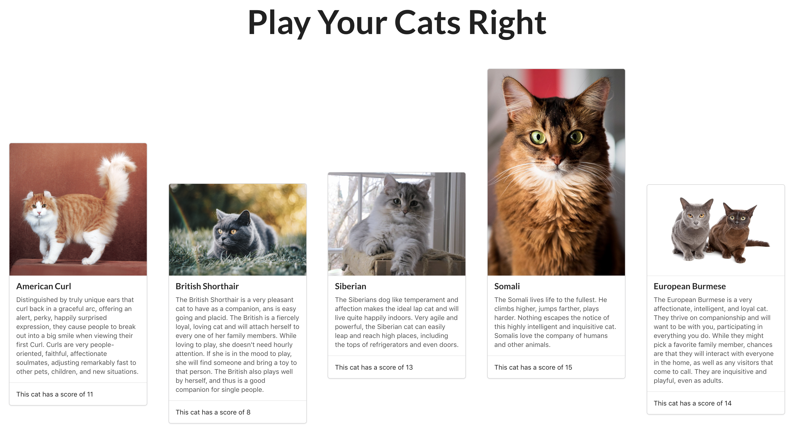

# Play your cats right

[](https://travis-ci.com/jonesandy/play-your-cats-right)


----

A small fun app to see if you can guess the cat's score and if the next cat is higher or lower than the previous cat.

---




## Rules

Cats have each been given a score based around information coming back from the API. The score has been calculated: 

```
score = energy_level + affection_level + stranger_friendly
```

The aim of the game is to see if you can look at the picture, read the description and see if you can guess whether this cat's score is <b>HIGHER</b> or <b>LOWER</b> that the previous one. When you are ready, click the button to reveal the score.

In this game you do get something for a pair! If the scores are the same it counts as a success and you can move on to the next cat.

<em>N.B this app is currently a work-in-progress. No automation or score logic has been implemented yet. It's up to you to guess and click. No cheating!</em>


## Setup

To run this application locally requires an API key from [TheCatApi](https://thecatapi.com/).  Once you have signed up for a key, you will need to create a ```.env``` file inside the root folder of the application.

```bash
// Inside the root folder
touch .env
```
Inside this file you will need to add the following text.

```bash
CAT_API_KEY='xYOUR_API_KEY_HEREx'
```

### Running application

To run this application locally while developing make sure you are in the root folder. Then run the command:

```bash
npm start
```

The server will start and open the application in your web browser.

### Tests

To run tests, in the root folder run command:

```bash
npm test
```
