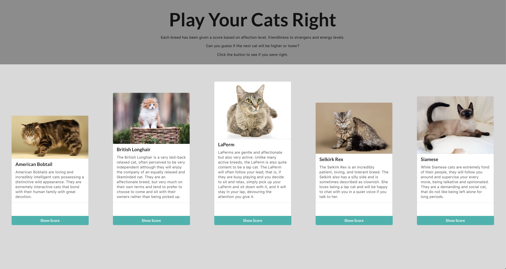

# Play your cats right


----

A small fun app to see if you can guess the cat's score and if it's higher or lower than the previous cat.

---




## Rules

In this game you do get something for a pair! If the scores are the same it counts as a success and you can move on to the next cat.


## Setup

To run this application locally requires an API key from [TheCatApi](https://thecatapi.com/).  Once you have signed up for a key, you will need to create a ```.env``` file inside the root folder of the application.

```bash
// Inside the root folder
touch .env
```
Inside this file you will need to add the following text.

```bash
CAT_API_KEY='xYOUR_API_KEY_HEREx'
```

### Running application

To run this application locally while developing make sure you are in the root folder. Then run the command:

```bash
npm start
```

The server will start and open the application in your web browser.
